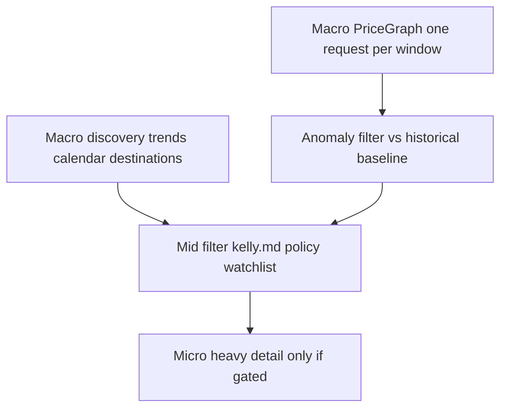

# Kelly MCP architecture (reference)

This document is the blueprint for refactoring **kelly-travel-planner**. **Do not paste real secrets into git**; use `.env` only (already in `.gitignore`).

---

## 0. Current baseline (as of repo state)

- `src/kelly/settings.py`: `load_dotenv` from project root (`pyproject.toml` walk or `KELLY_PROJECT_ROOT`).
- Cash: `src/kelly/orchestrator.py` → `src/kelly/services/micro_service.py` (RapidAPI `providers/google_flights.py` or `serpapi_client.py`) via `KELLY_CASH_BACKEND`.
- Awards: `src/kelly/seats_aero_client.py` (non-RapidAPI).
- MCP: `src/kelly/mcp_server.py` (FastMCP tools, thin delegation to services; no MCP-in-MCP for outbound calls).

---

## 1. Goal 1 — Sandboxing and configuration

### 1.1 Dependency injection vs secrets

- **Requirement:** Kelly loads secrets from the repo, not only from the parent process.
- **Implementation:** `python-dotenv`; resolve **project root** (walk from `Path(__file__)` until `pyproject.toml`, or `KELLY_PROJECT_ROOT`); `load_dotenv(project_root / ".env", override=False)` then optional `.env.local`.
- **OpenClaw:** Pass `command` / `cwd` / `transport`; no need to duplicate secrets in `openclaw.json` if `cwd` is the repo and `.env` lives there.

### 1.2 Single RapidAPI key

- `rapidapi_key()` reads `RAPIDAPI_KEY`; optional `RAPIDAPI_*_HOST` overrides per API.
- `.env.example`: documents empty keys. Setup: copy to `.env`, set `RAPIDAPI_KEY=`.

### 1.3 `.gitignore`

- Ignores `.env`, `.env.*`, with `!.env.example`.

### 1.4 HTTP stack

- **`httpx`** for RapidAPI; shared `RapidAPIClient` injects `X-RapidAPI-Key` and `X-RapidAPI-Host`.

### 1.5 No MCP inside Kelly

- All external data via **HTTP** only.

---

## 2. Goal 2 — Macro–Mid–Micro intelligence

### 2.1 Conceptual funnel



### 2.1a Cost-aware flight pipeline (Price Graph → Anomaly → Surgical Micro)

1. **Macro-Scan:** Provider calendar / price graph — one request per **month** touched in the window; normalized `[{date, indicative_price, currency?}, …]`.
2. **Anomaly:** Historical baseline from SQLite + `analytics`; label days (normal / cheap vs history / opportunity vs `target_price`).
3. **Micro-Scan:** Heavy flight endpoint only for flagged dates, capped per invocation.

### 2.2 Extending `kelly.md`

- YAML under frontmatter: `travel_policy: { max_stops, direct_only, baggage }`.
- Parsed in `md_config.py` as `TravelPolicy`.

### 2.3 Internal modules

| Area | Responsibility |
|------|----------------|
| `kelly/http/rapidapi_base.py` | `RapidAPIClient` |
| `kelly/providers/google_flights.py` | Google Flights RapidAPI — search + price graph |
| `kelly/providers/kiwi.py`, `booking.py`, `tripadvisor.py` | Stubs / extend per subscription |
| `kelly/services/macro_service.py` | Macro orchestration |
| `kelly/services/mid_service.py` | Policy + watchlist matching |
| `kelly/services/micro_service.py` | Dated quotes |
| `kelly/services/anomaly_service.py` | Graph + baseline labels |
| `kelly/services/aggregator.py` | Gated pipeline |

### 2.4 Deprecation / migration

- `KELLY_CASH_BACKEND=rapidapi|serpapi` in settings; default RapidAPI when `RAPIDAPI_KEY` is set.
- `serpapi_client.py` retained for SerpApi-only setups.

---

## 3. MCP tool catalog (indicative)

### Macro

- `kelly_macro_month_overview`, `kelly_macro_cheapest_destinations`, `kelly_macro_flexible_trip`, `kelly_macro_price_graph`.

### Mid

- `kelly_mid_apply_policy`, `kelly_mid_match_watchlist`, `kelly_mid_explain_rejection`, `kelly_mid_anomaly_scan`, `kelly_pipeline_graph_to_details`.

### Micro

- `kelly_micro_flight_quote`, `kelly_micro_hotel_search`, `kelly_micro_tripadvisor_context`.

### Existing / cross-cutting

- `kelly_load_config` (includes `travel_policy`, `cash_backend`), `kelly_scan_watchlist`, `kelly_scan_opportunities`, `kelly_search_awards`, history / forecast tools.

### Resources

- `kelly://config`, `kelly://policy`.

---

## 4. Folder structure (target)

```text
src/kelly/
  settings.py
  mcp_server.py
  md_config.py
  cash_types.py
  http/rapidapi_base.py
  providers/google_flights.py, kiwi.py, booking.py, tripadvisor.py
  services/macro_service.py, mid_service.py, micro_service.py, anomaly_service.py, aggregator.py
  serpapi_client.py
  rapidapi_client.py  # re-exports
```

---

## 5. Implementation sequence (checklist)

1. Project-root `load_dotenv`; `RAPIDAPI_KEY`; `.env.example` + docs.
2. RapidAPI base + Google Flights provider + `micro_service`.
3. Macro service + macro MCP tools + tests (mocked HTTP).
4. Price graph + `kelly_macro_price_graph`.
5. Anomaly + `kelly_mid_anomaly_scan`.
6. Gated micro + `kelly_pipeline_graph_to_details`.
7. `travel_policy` + `mid_service` + mid tools.
8. Kiwi / Booking / TripAdvisor stubs.
9. Thin MCP; installer without secrets in JSON.
10. This `ARCHITECTURE_PLAN.md`.

---

## 6. Risks and mitigations

- **Quota:** Per-tool caps; price graph + gated micro as default cost pattern.
- **Schema drift:** Mocked JSON tests; env overrides for paths.
- **Policy:** Start with booleans + small ints.

---

## 7. Security

Rotate any API key that appeared in chat or tickets. Never `git add .env`.
